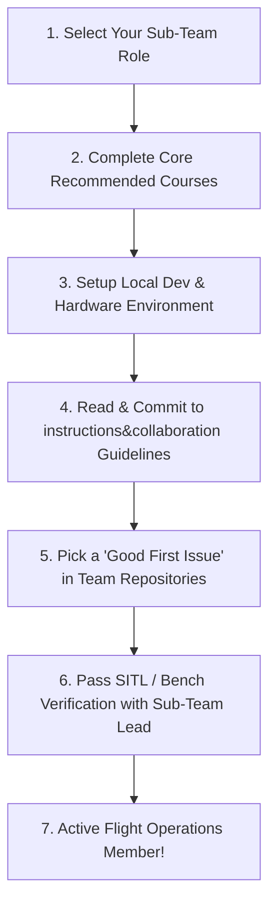

# 🚁 Xerox UAV Team

> **Welcome to the official repository for the Xerox UAV Quadcopter Organization.**  
> This repository serves as the central hub for team architecture, member onboarding, educational roadmaps, and mandatory engineering & collaboration standards.

---

## 📖 Table of Contents
1. [About Xerox UAV](#-about-xerox-uav)
2. [Team Sub-Teams & Roles](#-team-sub-teams--roles)
3. [Recommended Courses & Learning Roadmaps](#-recommended-courses--learning-roadmaps)
   - [1. AI & Perception](#1-ai--perception-roadmap)
   - [2. Software & Autonomy](#2-software--autonomy-roadmap)
   - [3. Hardware & Mechanical](#3-hardware--mechanical-roadmap)
   - [4. PCB Design & Electronics](#4-pcb-design--electronics-roadmap)
   - [5. Control & Dynamics](#5-control--dynamics-roadmap)
   - [6. Control Boards & Embedded Firmware](#6-control-boards--embedded-firmware-roadmap)
4. [Team Policies & Collaboration Instructions](#-team-policies--collaboration-instructions)
5. [New Member Onboarding Workflow](#-new-member-onboarding-workflow)

---

## 🌐 About Xerox UAV

**Xerox UAV** is a multi-disciplinary aerial robotics engineering team dedicated to the design, manufacturing, and autonomous deployment of advanced multirotor platforms (quadcopters). Our mission bridges cutting-edge theoretical research and robust real-world flight operations across competitive challenges, autonomous exploration, and aerial intelligence.

---

## 👥 Team Sub-Teams & Roles

The development of high-performance quadcopters requires tight cross-functional synergy. Our team is divided into six specialized technical sections:

### 1. 🧠 AI & Perception
- **Focus:** Autonomous perception, computer vision, visual-inertial odometry (VIO), SLAM, target tracking, and edge neural network inference.
- **Hardware/Tools:** NVIDIA Jetson Orin / Nano, OpenCV, PyTorch, TensorRT, depth cameras (Intel RealSense), edge accelerators.

### 2. 💻 Software & Autonomy
- **Focus:** System architecture, ROS 2 middleware, autonomous mission planning, behavior trees, MAVLink telemetry streaming, Ground Control Station (GCS) software, and SITL simulation.
- **Hardware/Tools:** ROS 2 (Humble/Iron), Modern C++ (C++17/C++20), Python, Gazebo Sim, PX4 SITL, QGroundControl.

### 3. 🛠️ Hardware & Mechanical
- **Focus:** Airframe structural design, aerodynamics, thrust-to-weight optimization, motor/propeller matching, CAD modeling, vibration dampening, and advanced fabrication (carbon fiber CNC machining and 3D printing).
- **Hardware/Tools:** Fusion 360, SolidWorks, 3D printers (PETG/CF-Nylon), thrust dynamometer test stands.

### 4. ⚡ PCB Design & Electronics
- **Focus:** Custom schematic design and PCB layouts, high-power distribution boards (PDB), sensor breakout boards, power switching regulators, EMI noise filtering, and battery management.
- **Hardware/Tools:** KiCad 8+, Altium Designer, multimeter, bench power supplies, digital oscilloscopes.

### 5. 🎯 Control & Flight Dynamics
- **Focus:** Mathematical modeling of multirotor 6-DoF dynamics, state estimation (EKF, sensor fusion), attitude and position control loop design (PID, LQR, Model Predictive Control - MPC), and aerodynamic disturbance rejection.
- **Hardware/Tools:** MATLAB / Simulink, Python Control Systems library, PX4 controller tuning tools.

### 6. 🎛️ Control Boards & Embedded Firmware
- **Focus:** Flight controller hardware architectures (Pixhawk, STM32 MCUs), low-level sensor drivers (SPI, I2C, UART, CAN), real-time operating systems (RTOS), and flight control firmware (PX4 Autopilot, ArduPilot, Betaflight).
- **Hardware/Tools:** STM32CubeIDE, FreeRTOS, NuttX, ST-Link/J-Link debuggers, logic analyzers.

---

## 🎓 Recommended Courses & Learning Roadmaps

To ensure that both new and current team members develop deep domain competence, every member is expected to study the curated courses and resources for their respective role:

### 1. AI & Perception Roadmap
- **Deep Learning & Computer Vision:**
  - *Deep Learning Specialization* – Andrew Ng (DeepLearning.AI / Coursera)
  - *CS231n: Deep Learning for Computer Vision* – Stanford University
  - *Modern Computer Vision with OpenCV and Python*
- **Edge Deployment & Robotics Perception:**
  - *NVIDIA Deep Learning Institute (DLI):* Getting Started with AI on Jetson Nano
  - *Visual SLAM:* *State Estimation for Robotics* (Timothy D. Barfoot)
  - *YOLO Object Detection & TensorRT Optimization Tutorials*

### 2. Software & Autonomy Roadmap
- **C++ & Systems Programming:**
  - *Modern C++ for Robotics (C++17/C++20)* – The Construct
  - *Effective Modern C++* – Scott Meyers
- **Robotics Middleware & Simulation:**
  - *ROS 2 Basics & Navigation (Nav2)* – The Construct / ROS 2 Official Tutorials
  - *Gazebo Sim Simulation & PX4 SITL Integration*
  - *MAVLink & MAVSDK Development Guide*

### 3. Hardware & Mechanical Roadmap
- **CAD & Mechanical Design:**
  - *Autodesk Fusion 360 / SolidWorks for Drone Design*
  - *Additive Manufacturing & Slicing Best Practices for High-Stress UAV Parts*
- **Multirotor Physics & Aerodynamics:**
  - *Multirotor Aerodynamics and Flight Mechanics* – MIT OpenCourseWare / AIAA
  - *Propulsion Systems Sizing: Motors, ESCs, Propellers & Battery Chemistry*

### 4. PCB Design & Electronics Roadmap
- **EDA & Schematic/PCB Layout:**
  - *KiCad Like a Pro (v8)* – Dr. Peter Dalmaris
  - *High-Speed PCB Layout & Grounding Techniques* – Rick Hartley (Altium Academy)
- **Power Electronics & Noise Mitigation:**
  - *Switch-Mode Power Supply (SMPS) Design & Filtering* – Texas Instruments Precision Labs
  - *IPC-2152 Standard for Determining Current Carrying Capacity in Traces*

### 5. Control & Dynamics Roadmap
- **Classical & Modern Control:**
  - *Control Systems Lectures* – Brian Douglas (MATLAB Tech Talks)
  - *Feedback Control of Dynamic Systems* – Gene F. Franklin
- **Aerial Robotics & Dynamics:**
  - *Aerial Robotics* – Prof. Vijay Kumar (University of Pennsylvania / Coursera)
  - *Underactuated Robotics: Algorithms for Walking, Running, Swimming, Flying, and Manipulation* – Russ Tedrake (MIT)
  - *Extended Kalman Filter (EKF) Sensor Fusion for Attitude & Position Estimation*

### 6. Control Boards & Embedded Firmware Roadmap
- **Microcontrollers & RTOS:**
  - *Embedded Systems Architecture on ARM Cortex-M* – FastBit Embedded Brain Academy
  - *Mastering FreeRTOS & Real-Time Kernel Concepts*
- **Flight Firmware Development:**
  - *PX4 Autopilot Software Architecture & NuttX OS Guide* (docs.px4.io)
  - *ArduPilot Dev Guide & DroneCAN Protocol Specifications*
  - *Hardware debugging with SWD / JTAG & Logic Analyzers*

---

## 📜 Team Policies & Collaboration Instructions

> [!IMPORTANT]
> ### ⚠️ Mandatory Policy Adherence
> **Every single team member—regardless of seniority—who collaborates, commits code, designs hardware, or participates in quadcopter development must be strictly loyal to the guidelines and policies established in the `instructions&collaboration/` directory.**
>
> Bypassing code reviews, violating safety procedures, ignoring linting rules, or skipping physical verification protocols will result in immediate rejection of contributions and suspension from flight-test operations.

Detailed, domain-specific instruction manuals are maintained in the [`instructions&collaboration/`](instructions&collaboration/) directory:

| Guide | Description | Target Sub-Teams |
| :--- | :--- | :--- |
| [**`GIT_GITHUB_INSTRUCTION.md`**](instructions&collaboration/GIT_GITHUB_INSTRUCTION.md) | Universal Git standards, Conventional Commits, branch naming, PR lifecycles, and rebase conflict resolution. | **All Team Members** |
| [**`PYTHON_DEVELOPMENT.md`**](instructions&collaboration/PYTHON_DEVELOPMENT.md) | Modern Astral toolchain (`uv`, `ruff`, `ty`), strict typing, frozen dataclasses & Pydantic, and real-time practices. | AI, Software, Tooling |
| [**`PCB_DESIGN.md`**](instructions&collaboration/PCB_DESIGN.md) | KiCad rules, high-current routing, TVS & reverse-polarity protection, noise isolation, DRC/ERC, and bench bring-up safety checklists. | PCB Design, Electronics |
| [**`AI_DEVELOPMENT.md`**](instructions&collaboration/AI_DEVELOPMENT.md) | Real-time latency budgets (FPS/ms), TensorRT export, DVC data versioning, fail-safe fallbacks, and "Never Fly Blind" policy. | AI & Perception |
| [**`SOFTWARE_DEVELOPMENT.md`**](instructions&collaboration/SOFTWARE_DEVELOPMENT.md) | Concurrency (Async vs Sync), Design Patterns (Factory/Strategy), Clean Architecture (Hexagonal), and 6-step safety ladder. | Software, Systems |

---

## 🚀 New Member Onboarding Workflow

If you are joining the Xerox UAV Team, complete the following steps in order:

1. **Select Your Primary Role:** Choose from AI, Software, Hardware, PCB Design, Control, or Control Boards.
2. **Study the Fundamentals:** Work through the recommended courses listed above.
3. **Environment Setup:** Configure your workstation with the required tools (Ubuntu 22.04 LTS, ROS 2, KiCad, or CAD suites).
4. **Read All Policies:** Thoroughly study the relevant documentation in [`instructions&collaboration/`](instructions&collaboration/).
5. **Contribute:** Pick a `good first issue` from our repository issue trackers, follow our branching and PR checklist, and submit your first Pull Request.
6. **Safety First:** Always remember: **Propellers remain OFF on all bench tests.**

---

*Fly safe, build rigorously, and innovate fearlessly.*  
**Xerox UAV Team**
